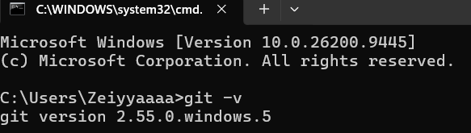
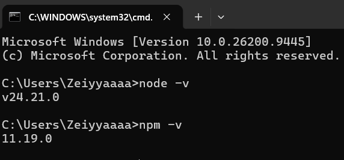
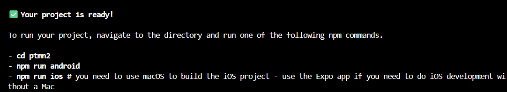
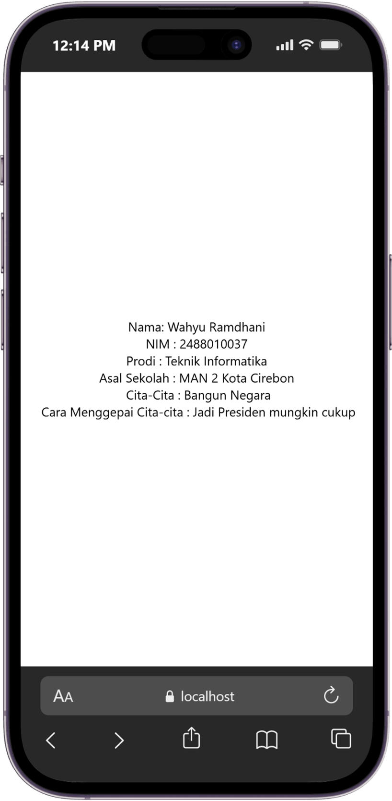

# Praktikum Menyiapkan LingkunganPengembangan dan Memulai Pemograman Mobile (React Native) #

## Tujuam Pemblajaran ##
Mahasiswa mampu :
1. Menyiapkan lingkungan pengembangan dan memulai pemograman mobile(React Native)
2. Membuat apk mobile dengan React Natieve
3. Menyelesaikan tugas CV sederhana dengan React Native

## Materi dan Laporan Praktikum ##
1. Menyiapkan lingkungan pengembanga dan memulai pemrograman mobile(React Native)
    - Memastikan instalasi Git bash
        - Cek instalasi Git bash (git --version)
        - Bukti verifikasi
    
    - Memastikan Node.Js dan NPM
        - Download dan Install Node.JS di https://nodejs.org/en/download/
        - Konfirmasi Node>JS dan NPM node (-v, npm -v)
    
2. Membuat Aplikasi / Project baru dengan React Native Framework Expo Go
    - Buka dan baca document resmi link https://docs.expo.dev/
    - Buka dan baca document resmi link https://reactnative.dev/docs/getting-started
    - Memulai membuat project baru
    - Open terminal change directory kr pertemuan-2
    - Masukkan perintah (npx create-expo-app ptmn2 --template blank)
    - Bukti verifikasi
    
    - Running project
        - Cd ke ptmn2
        - npx expo start
        - Install expo go di android atau ios
        - bisa juga menggunakan web imulator dilaptop / pc
        - setelah berhentikan (ctrl + c)
        - install (npx expo install react-dom react-native-web)
        - npx expo start --web
        - konfirmasi keberhasilan

4. tugas praktikum
    - membuat aplikasi cv sederhana dengan react native 
    - nama lengkap
    - nim
    - asal sekolah
    - cita-cita
    - rencana menggapai cita-cita
    
    

konfirmasi keberhasilan.