# Laporan pertemuan 3: Core Componente dan Styling #

### Langkah 1: Import library & components ###
1. Buka File App.js yang ada di folder proyek ptmn2
2. Import library dan Component yang diperlukan
3. Konfirmasi Bukti

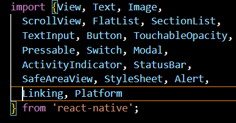

### Langkah 2: Membuat Array Objek ###
1. Data Profile dan Skill

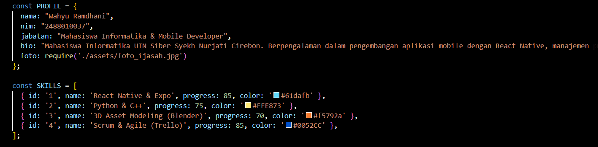

2. Data Riwayat(section)

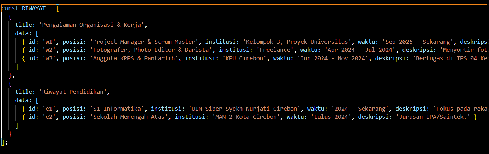

### langkah 3: Sub-Components (SkillCard & TimelineCard) ###

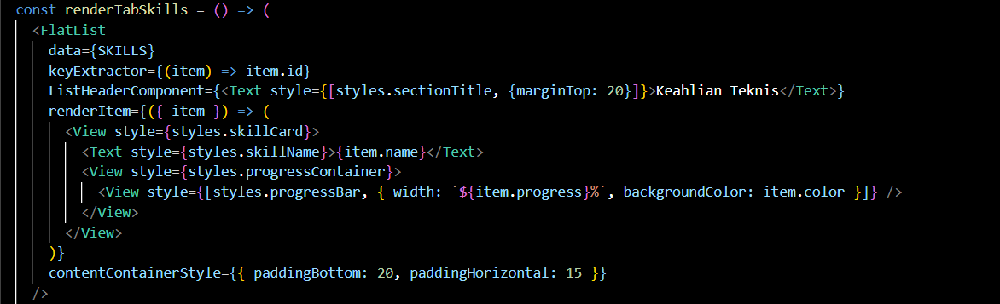

### langkah 4: State Management dengan useState ###

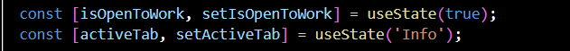

### langkah 5: SafeAreaView, StatusBar & Header ###

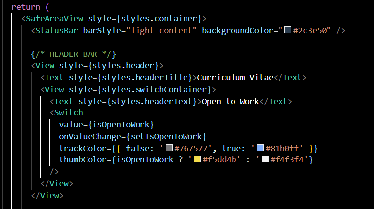

### langkah 6: ScrollView & Profil Section (View, Text,  img/image) ###

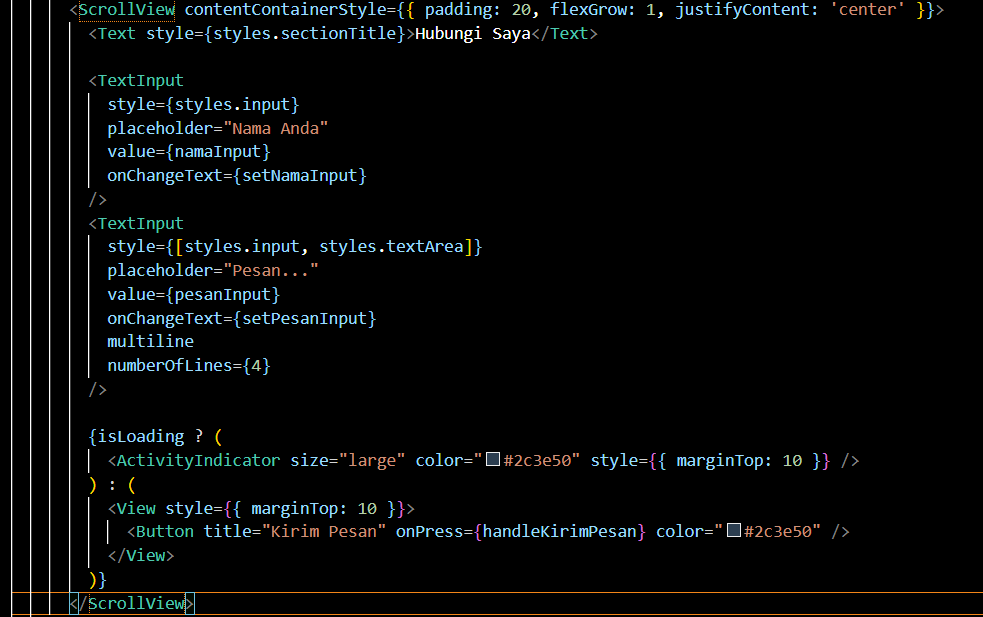
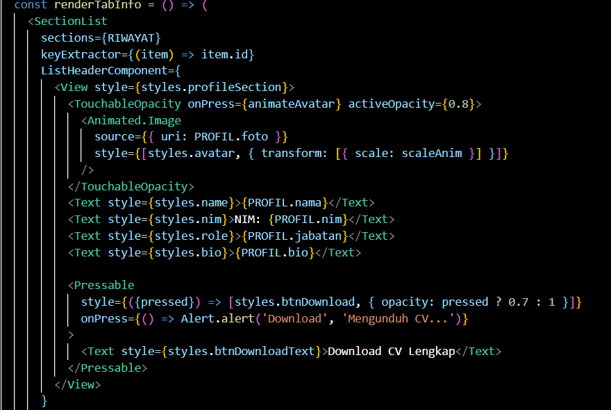

### langkah 7: FlatList (Daftar Skills) ###

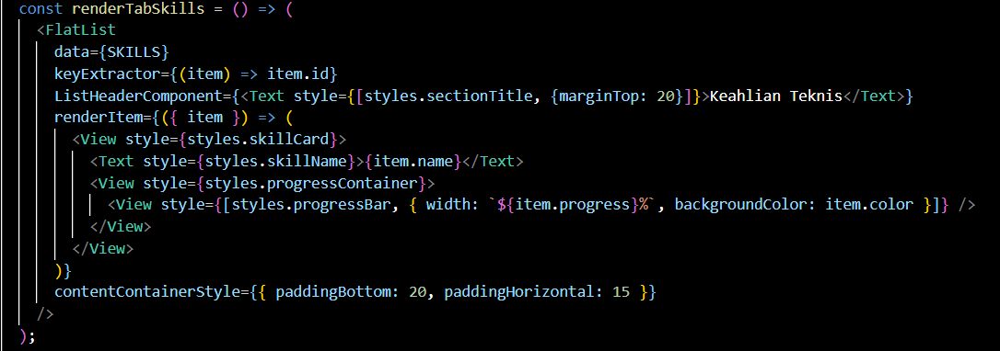

### langkah 8: SectionList (Pengalaman & Pendidikan) ###

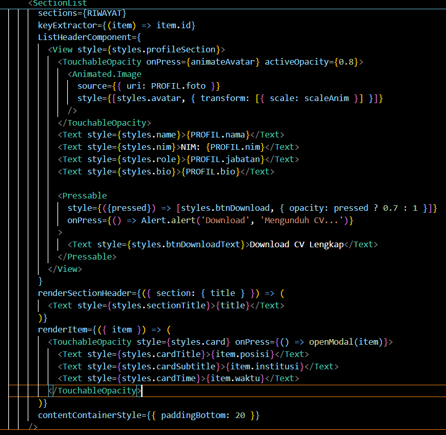

### langkah 9: TextInput, Button & ActivityIndicator ###

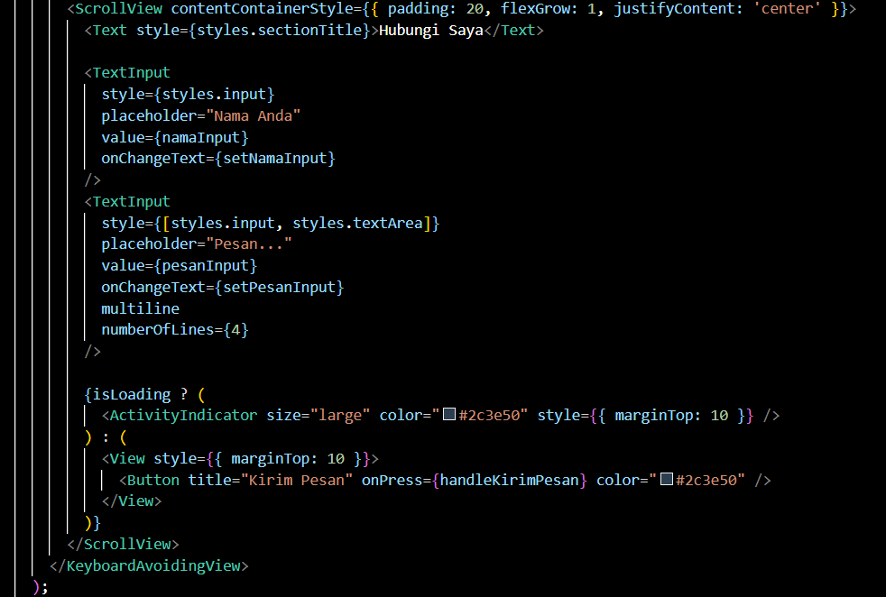

### langkah 10: Modal (Popup Detail) ###

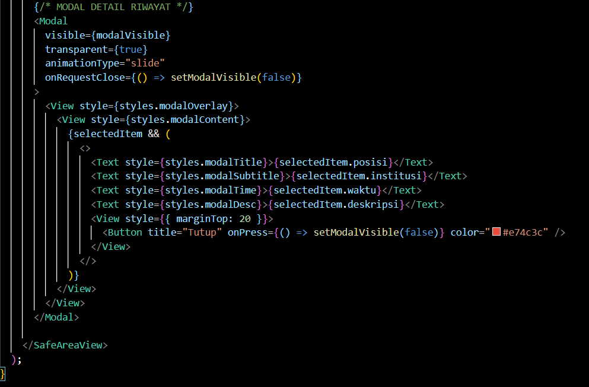

### langkah 11: StyleSheet (Styling Terpusat) ###

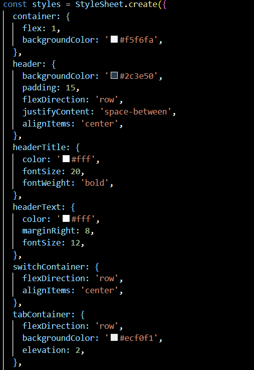
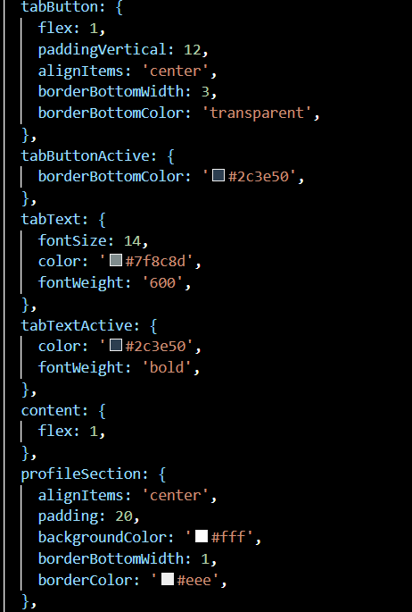
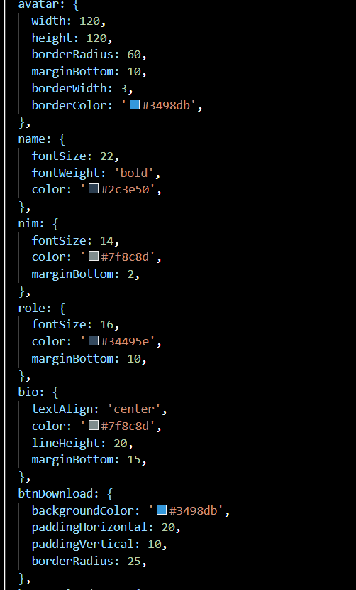
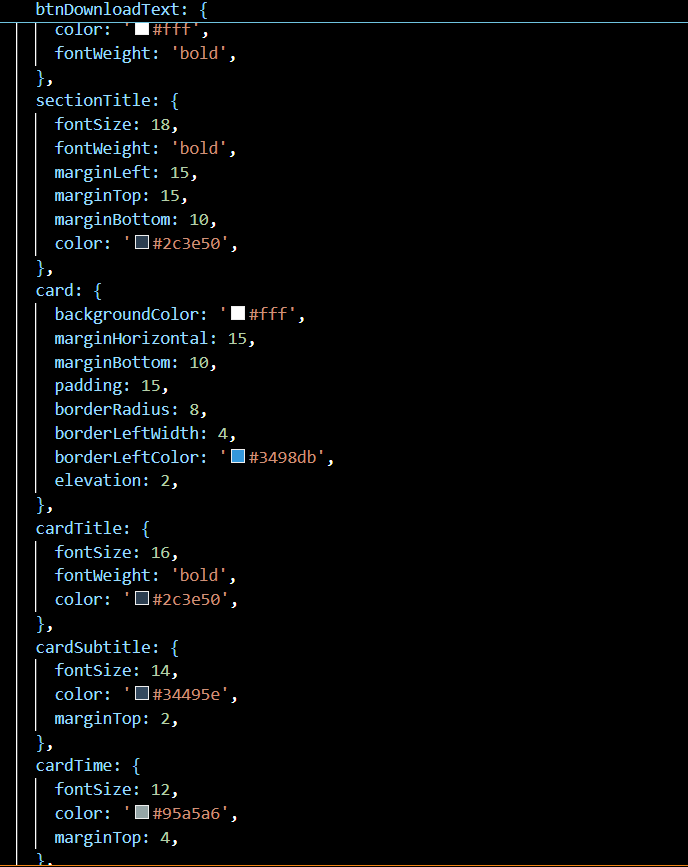
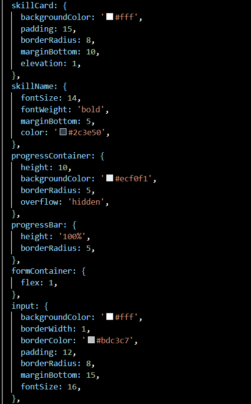
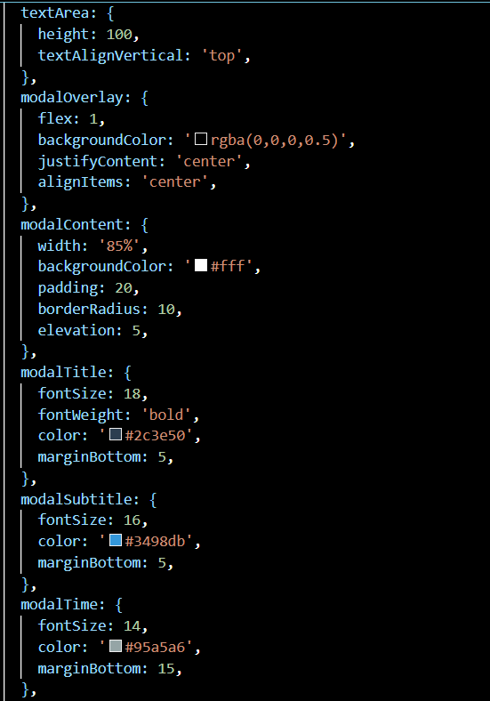
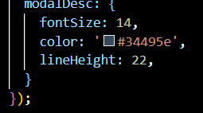

### Langkah 12: Verifikasi ###
1. Aplikasi bisa dibuka, Layar CV tampil tanpa error
2. Foto profil tampil, Gambar dari URL terload
3. Halaman bisa di-scroll, Semua section bisa diakses
4. Toggle Switch, Badge "Open to Work" muncul/hilang
5. Progress bar skill, Bar berwarna sesuai persentase
6. Ketuk kartu riwayat, Modal popup muncul dari bawah
7. Tombol Tutup di Modal, Modal tertutup
8. Isi form & kirim, Loading 2 detik → Alert sukses
9. Kirim dengan input kosong, Alert peringatan muncul
10. Tekan Download CV, Efek visual berubah + Alert
11. Tap tombol sosmed, Alert URL muncul

  