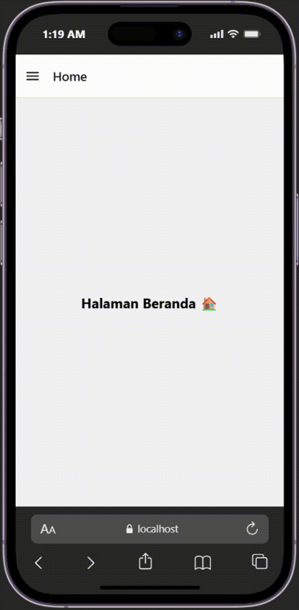

# Navigasi di React Native #

## Alur Praktikum ##

### Langkah 1: Instalisasi Proyek dan Isntalisasi Dpendencies ###

1. Buka terminal atau commend promp
2. Ubah directorinya ke folder pertemuan 4, cd "Pemrograman Mobile\Pertemuan-4"
3. Buat proyek bbaru menggunakan perintah berikut: 'npx create-expo-app ptmn4 --tempalte blank'
4. Masuk ke dalam folder  proyek menggunakan perintah berikut: 'cd ptmn4'
5. Install core navigation library
npm install @react-navigation/native
6. Install dependensi pendukung (wajib untuk Expo) npx expo install react-native-screens react-native-safe-area-context react-native-gesture-handler react-native-reanimated

### Langkah 2: Membuat Stack Navigator ###

1. Instalisasi Pustaka Stack: npm install @react-navigation/native-stack
2. Buat folder didalam project dengan nama screens
3. Didalam folder screens buat 2 file bernama Login.js dan Sign.js
4. Masukan code sesuai dengan modul praktikum4
5. Sesuaikan file App.js dengan code yang ada pada modul.
6. Simpan dan install dependensi untuk web "npx expo install react-down react native --web
7. Jalankan perintah npx expo start --web
8. Konfirmasi bukti.

<!-- <video src="login.webm" autoplay ="true" loop="true"  muted = "true" width ="15%"></video> -->

### Bottom Tab Navigation ###
1. Instalasi Pustaka Bottom Tabs (npm install @react-navigation/bottom-tabs)
2. Buat file HomeScreen.js dan ProfileScreen.js di dalam folder screens.
3. Ubah isi App.js, sesuaikan dengan code module
4. konfirmasi bukti

### Drawer Navigation ###
1. Instalasi Pustaka Drawer (npm install @react-navigation/drawer)
2. Ubah kembali file App.js sesuai dengan code pada module

